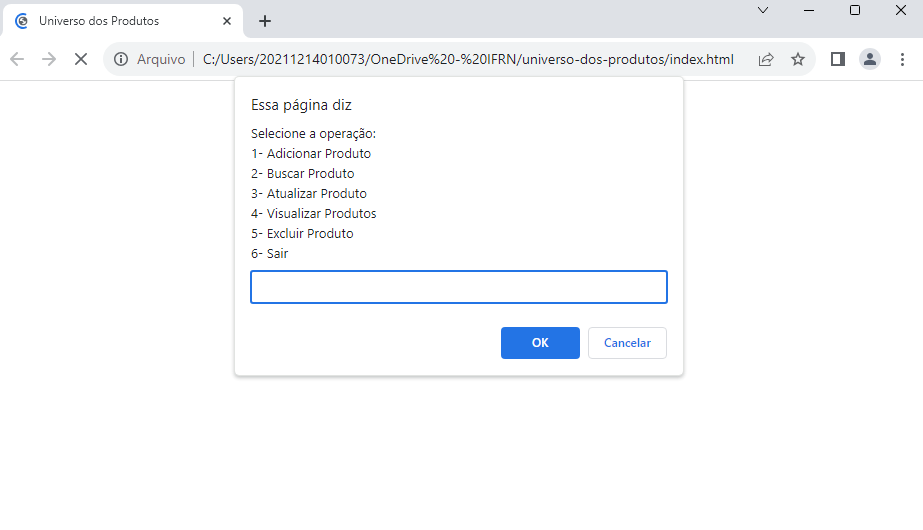

<h1 align="center"> 🔬 Catálogo de Produtos</h1>

## 🖥️ Trabalho

Trabalho web realizado como teste de aprendizado. Trata-se de um site de catálogo de produtos, no qual foi chamado de "Universo dos Produtos", contendo funções como adicionar, buscar, atualizar, vizualizar e remover produtos.

## ⚡ Tecnologias

Esse projeto foi desenvolvido com as seguintes tecnologias:

- HTML
- JAVASCRIPT
  
## 🏷️ Layout

